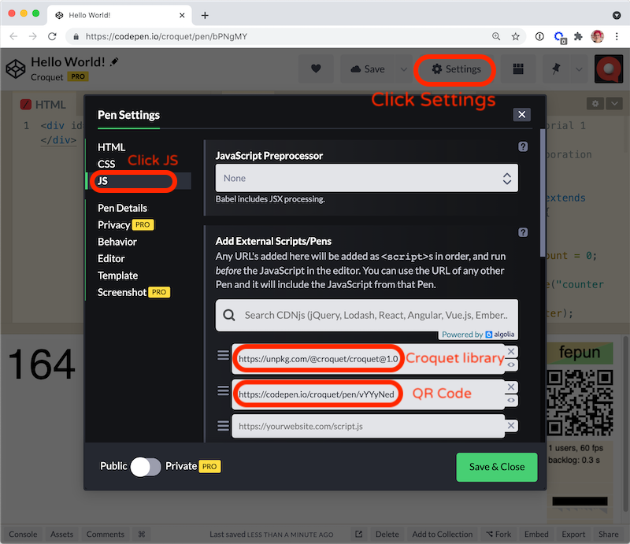

Copyright © 2025 Croquet Labs

## We are using CodePen for our tutorials.

That allows us to place a working example right in the tutorials for you to try out live.
CodePen is extremely easy to use.
You will certainly want to fork the tutorial code to try out your own ideas.
Information for getting started is here:

{@link https://codepen.io/hello}

Below is the Multisynq Hello World app running live in CodePen.
Click the "JS" button to show the code (and maybe the "Result" button to make the code view wider).
Scroll through the code.
You will see that a simple Multisynq app is indeed very simple.

<p class="codepen" data-height="512" data-theme-id="37190" data-default-tab="result" data-user="multisynq" data-slug-hash="yyyMqKb" data-editable="true" style="height: 512px; box-sizing: border-box; display: flex; align-items: center; justify-content: center; border: 2px solid; margin: 1em 0; padding: 1em;" data-pen-title="Hello World!">
  <span>See the Pen <a href="https://codepen.io/multisynq/pen/yyyMqKb/">
  Hello World!</a> by Multisynq (<a href="https://codepen.io/multisynq">@multisynq</a>)
  on <a href="https://codepen.io">CodePen</a>.</span>
</p>
<script async src="https://static.codepen.io/assets/embed/ei.js"></script>


## **Try it out!**

The first thing to do is click or scan the **QR code** near the top right
of the CodePen window.
This will launch a new CodePen instance of this session.
If you compare the two counters, you will see that they are identical.
If you click the counter in either of these views, the counts in both will reset to 0.

## **Edit it!**

To make changes, click the "Edit on CodePen" button on the CodePen title bar.

**NOTE:** If you make a change to your own Multisynq CodePen app,
you MUST save it before you create a new instance/copy.
Otherwise, you will have one instance in the same session running an older version,
and they will not synchronize properly.


The **session badge** (the colored rectangle near the QR code) indicates the session you are in.  The session is identified with two automatically assigned colors and a five-letter nonsense word.  Users who are participating in the same session - who are seeing the same badge - are guaranteed to be in sync.

Any change to the model code will create a new session, with a different badge.  Only when other users load that changed code will they be able to join the new session.  If you are logged into CodePen and editing your own pen, you will find that switching the view to "Debug Mode", for example, also creates a distinct session - in this case, shared by however many debug-mode views you create.

## CodePen is a live coding environment

This means that it will often restart the app as you are editing text.
This is usually not a problem, but can be a bit distracting.
If you would rather edit your code without it being executed automatically,
disable "Auto-Updating Preview" in your pen's Settings - Behavior tab.
This will add a "Run" button that you press when you're finished editing.

# There are three things we will learn here

1. How to access and use the Multisynq client library.
2. Adding the QR code to your app.
3. Writing a proper model/view application.

## Using the Multisynq client library
All of the Multisynq support code is included within the Multisynq client library. Typically, to access it within your Javascript application you add it to your HTML:

```
<script src="https://cdn.jsdelivr.net/npm/@multisynq/client@@CLIENT_VERSION@"></script>
```

When we use CodePen, we include the same library by adding it in the Pen Settings



## Using a QR code in CodePen

Multisynq uses QR codes to assist in sharing a Multisynq session.
When set up properly, all you need to do is scan the QR code to find and load a new instance of the current session.
This makes it particularly easy to test and share Multisynq applications with mobile users.

**Scanning a QR code** is built into the default camera apps on iPhones and Android phones.

If you created a new Pen from scratch (not forking one of the tutorials here) and you want the same join-by-QR functionality:

* add the Pen `https://codepen.io/multisynq/pen/vYYyNed` as an additional JS resource (in the same way you included the Multisynq client library above) - it will automatically add a session badge, and a QR code linked to your Pen.
* you may also add that same Pen in the CSS settings for positioning of the session badge.
  Or, just copy the Pen's CSS so you can position it to fit your app.
* if you want the QR code to appear in another position, override the CSS settings of the `#widgets` element.  The Pen for the [Multiuser Chat](https://codepen.io/multisynq/pen/NZjLzO) includes an example of this.

## Writing a Multisynq Application

***Every Multisynq application consists of two parts:***

- The **model** handles all calculation and simulation. This is where the actual work of the application takes place. The model is guaranteed to run bit identical on every instance of a session. The model is also where save / load happens.
- The **view** handles user input and display output.
  It processes all keyboard / mouse / touch events, and determines what is displayed on the screen.

***There are a few rules to start:***
- The model **MUST NOT EVER** communicate or directly access the view in **ANY WAY**.
- The view **CAN READ** from the model but **MUST NOT EVER** write directly into it.

Instead we use messages sent via publish and subscribe.

Our first **Hello World** app is very simple.
It is a counter that increases by one every second.
Any participant clicking on it resets the count to 0.
All participants will see the exact same count and will see it reset when any of them clicks.
A new user can join at any time and will be perfectly synced with the existing users.

## Model

If you scroll all the way up in the CodePen JS tab, you will see the Model class code.

_Hint:_ double-click the divider between the CSS and JS tabs to make the JS tab wider.
```
class MyModel extends Multisynq.Model {

    init() {
        this.count = 0;
        this.subscribe("counter", "reset", this.resetCounter);
        this.future(1000).tick();
    }

    resetCounter() {
        this.count = 0;
        this.publish("counter", "changed");
    }

    tick() {
        this.count++;
        this.publish("counter", "changed");
        this.future(1000).tick();
    }

}

MyModel.register("MyModel");
```

Our new class MyModel is a subclass of [Multisynq.Model]{@link Model}.
Multisynq.Model implements the core functionality required to ensure that MyModel works as a replicated object.
Our new model has three functions, init(), resetCounter() and tick().
All Multisynq models must have an init function.
The other two are used to run the simulation and respond to messages from the view.

### MyModel.init()
We do not define a constructor.
This is already defined in Multisynq.Model and will be called automatically.
The MyModel.init() function is called automatically when we start the session.
MyModel.init() is only called once when a session first begins.
After that, the model and its properties are automatically saved and loaded.
init() will never be called again for this session, even in new browser tabs joining the session.

```this.count = 0;```

MyModel has one property called "count" initialized to 0.
This is a very simple Multisynq app, and that value contains its entire state.

```this.subscribe("counter", "reset", this.resetCounter);```

MyModel subscribes to all "reset" events sent in the "counter" scope.
This is the kind of event that this app's view will publish in response to a user click.
When the model receives such an event, it will execute its resetCounter method.

```this.future(1000).tick();```

This is where the fun starts and the system comes to life.
The tick function is where our simulation code lives.
The future(1000) function is actually a way to delay the execution of the tick function for 1000 milliseconds - or one second.
This "future message" is a key to how time works in Multisynq - it is very simple, but extremely powerful.
In this case, the first tick() function call will occur one second after the init() function is executed.

### MyModel.resetCounter()

MyModel specified this method as the handler for "reset" events in the "counter" scope.
The first job in handling the event is to reset this.count to 0.


```this.publish("counter", "changed");```

Now the model publishes an event notifying the view that the count has changed.
As seen below, the view subscribes to these "changed" events, and handles them by modifying its display.

### MyModel.tick()

The tick method was called 1000 milliseconds in the future in the init function when the new Multisynq model was created.
The main job of tick() is to increment the count and then, like in resetCounter(), to publish an "changed" event specifying the new value.

```this.future(1000).tick();```

Finally, tick() itself schedules a tick call for 1000 milliseconds in the future, just as the init function did earlier. This is how we keep the ticks going.
What is really happening is that the model has an internal message queue, sorted by time.
The future call inserts a message into the queue, timed for execution after a further 1000 milliseconds.

### register()

```MyModel.register("MyModel");```

Every time you define a new model subclass, you must register() it so that Multisynq knows it exists.

## View

The HTML tab defines an element named `countDisplay`:
```
<div id="countDisplay"></div>
```
The view code in the JS tab references `countDisplay`:
```
class MyView extends Multisynq.View {

    constructor(model) {
        super(model);
        this.model = model;
        countDisplay.onclick = event => this.counterReset();
        this.subscribe("counter", "changed", this.counterChanged);
        this.counterChanged();
    }

    counterReset() {
        this.publish("counter", "reset");
    }

    counterChanged() {
        countDisplay.textContent = this.model.count;
    }

}
```

Our MyView class is a subclass of the Multisynq.View class. It has two responsibilities. First is to receive messages - for a start, from the model, so the view can interpret and display the state of the model to the user. Second is to receive input from the user and publish those events so that the model can then respond to them.

### MyView.constructor(model)

Note that the model is an argument to the constructor. This object reference **MUST** be used solely for read-only access. Any modification to the model by the view here will very likely break the Multisynq replication.

```super(model);```

Since myView is a subclass, we need to ensure that the base-class constructor is executed.

```this.model = model;```

We keep a reference to the model around so we later can read from it.

```countDisplay.onclick = event => this.counterReset();```

This is a vanilla tracking of a user event and then calling the counterReset function defined below.

```this.subscribe("counter", "changed", this.counterChanged);```

This subscription will cause each "changed" event to invoke counterChanged().

```this.counterChanged();```

This updates the displayed value to match what the model's count is right on session start.
Otherwise, the displayed value would be wrong until the first "changed" event was received.

### MyView.counterReset()

In response to user input, the view will publish an event.
Subscribing in the model to an event published by a view is the only way to affect the model's behavior from the outside, everything else in the model is fully deterministic.

```this.publish("counter", "reset");```

The view publishes a "reset" event in the "counter" scope. As detailed above, this is the kind of event that MyModel subscribes to. Multisynq automatically ensures that every MyModel instance (i.e., the model for every user in this app session) receives the event, regardless of which user's view published it. This is crucial to how Multisynq synchronization works.

### MyView.counterChanged()

This method is called whenever the model has adjusted its count and published a "changed" event.
The view changes the textContent value of the "countDisplay" element to whatever count the model has.

Note that we are reading directly from the model state here.
Unlike in traditional server/client computing, where the server state is not directly accessible by the client, the replication architecture of Multisynq ensures that all clients are already up-to-date.

## Multisynq.Session.join({ apiKey, appId, name, password, model, view, options })

```
Multisynq.Session.join({
  apiKey: "your_api_key",
  appId: "io.codepen.multisynq.hello",
  name: "public",
  password: "none",
  model: MyModel,
  view: MyView
});
```

Multisynq.Session.join is where the application is actually launched. The arguments are the [apiKey](https://multisynq.io/coder), appId, session name, session password, the MyModel class, the MyView class, and any options you may wish to include.

Starting the session will do the following things:

1. Connect to a nearby public synchronizer using the provided [API key](https://multisynq.io/coder)
2. Instantiate the model
3. a) Run the initialization code in the model's init routine<br>
   -or-<br>
   b) Initialize the model from a saved snapshot
4. Instantiate the view, passing the view constructor a reference to the model
5. Create a main event loop and begin executing

## Share your new world!

Once your Multisynq session is operational, you need only copy the web page links to add a new user/instance.
Every new user will have exactly the same model state and any action by any of them on the system will update everyone else's in exactly the same way.
Your Multisynq application is alive and running anywhere you send the URL.
