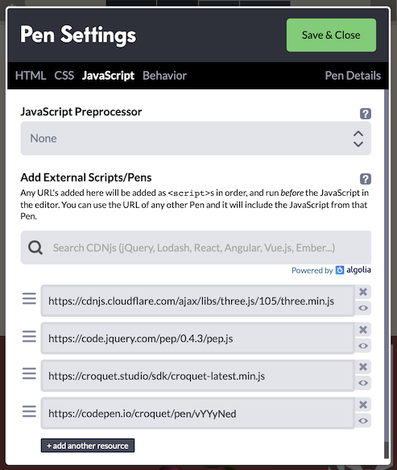

Copyright © 2025 Croquet Labs

This is an example of how a Multisynq app can call on the services of a rich, independently developed JavaScript library - in this case, <a href="https://threejs.org/">Three.js</a> for 3D rendering through WebGL. The example extends into the third dimension the kind of simulation shown in the Simple Animation tutorial: in this case, balls bounce off the (invisible) walls of a container, and off a sphere that's embedded in the container's far wall. Dragging the sphere moves it, constrained to the container bounds.  Clicking on the sphere resets the balls' positions to the sphere's center.

<p class="codepen" data-height="477" data-theme-id="37190" data-default-tab="result" data-user="multisynq" data-slug-hash="dPPvqEX" style="height: 477px; box-sizing: border-box; display: flex; align-items: center; justify-content: center; border: 2px solid; margin: 1em 0; padding: 1em;" data-pen-title="Simple Animation">
  <span>See the Pen <a href="https://codepen.io/multisynq/pen/dPPvqEX/">
  3D Animation</a> by Multisynq (<a href="https://codepen.io/multisynq">@multisynq</a>)
  on <a href="https://codepen.io">CodePen</a>.</span>
</p>
<script async src="https://static.codepen.io/assets/embed/ei.js"></script>


## **Try it out!**
As usual, scanning or clicking on the QR code will launch a new CodePen instance of this session. In any instance, try clicking on or dragging the central sphere.

This tutorial assumes that you have worked through the Simple Animation example, because the app described here follows essentially the same pattern:

* there is a root MyModel, with a collection of BallModel children;
* correspondingly, there is a root MyView that creates a BallView for each BallModel;
* each BallModel calculates its position from moment to moment, including bouncing when necessary, and publishes the new position;
* each BallView is responsible for creating a visual object for the ball, and repositions that visual object in response to position-change events published by the BallModel.

The tutorial demonstrates the following:

1. Importing an external library for a Multisynq app to use
2. Initializing the services provided by a library
3. Pre-processing input events to determine which should be passed to Multisynq
4. Handling input events using Multisynq publish/subscribe
5. Calling an external library's rendering facilities from Multisynq's update loop

## Importing an External Library

  The same mechanisms can be used to incorporate a third-party library into a Multisynq application as would be used for any other web app: `<script>` tags in pure HTML, `import` or `require` statements in a module-based setup, and so on.

  Because our tutorials are built using CodePen, we can take advantage of CodePen's external-JavaScript settings. We import the minified <a href="https://threejs.org/">Three.js</a> library, and also the <a href="https://github.com/jquery/PEP">Pointer Events Polyfill</a> (PEP) that provides a unified mouse/pointer event interface across a range of browsers and device types. This image shows the full set of CodePen JavaScript imports:

  

## Initializing the Library-Defined Services

  Three.js provides a collection of classes that enable an application to set up a scene filled with 3D objects, and to render those objects - as seen from a virtual camera at a specified position in the scene - in each animation frame (for example, 60 times per second). Rendering takes place onto a `<canvas>` element that the app developer adds to the HTML document.

  This app uses Three.js purely on the view side: that is, for creating a 3D rendering of the bouncing balls and of the central sphere that they bounce off.

  Importing Three.js sets up a global `THREE` object that includes all the classes needed to build a 3D scene.  For this app, the function `setUpScene()` initializes a `THREE.Scene` object that the  View code running in this Multisynq session instance will fill with 3D objects to represent the state of the Model.

  ```
  const scene = new THREE.Scene();
  scene.add(new THREE.AmbientLight(0xffffff, 0.5));
  const light = new THREE.PointLight(0xffffff, 1);
  light.position.set(50, 50, 50);
  scene.add(light);

  const camera = new THREE.PerspectiveCamera(75, window.innerWidth / window.innerHeight, 0.1, 10000);
  camera.position.set(0, 0, 4);
  const threeCanvas = document.getElementById("three");
  const renderer = new THREE.WebGLRenderer({ canvas: threeCanvas });
  renderer.setClearColor(0xaa4444);
  ```

  These first lines of `setUpScene` create the most basic parts of the renderable scene: the Scene object itself, some virtual lights, a camera, and a renderer that will render the scene to the canvas element defined in the app's HTML. The renderer is given a color (a subdued red) to use when clearing the canvas on each frame, before the scene's contents are drawn.

  `setUpScene` goes on to define handlers for the user-initiated events that this app needs to pay attention to: window resize, which requires adjustment of the Three.js camera and renderer; and `pointerdown`, `pointermove`, `pointerup` for handling either clicks or drags on the central sphere.

  Naturally, we want the Three.js scene to be set up just once for a given loading of the app's page. In this example, `setUpScene` is called from the `init` method of MyView, the root view object. We could have made `setUpScene` be a method of the MyView object itself - although in general a Multisynq app might have many objects that call on the same imported services, in which case it might not be obvious which one should include the library-initialization code.

## Hooking into Pointer Events

  The event handlers defined in `setUpScene` include the code for interpreting a pointer event on the HTML page - strictly, within the region of the canvas to which Three.js is rendering - as interactions with the 3D objects in the scene.

  ```
  function onPointerDown(event) {
    event.preventDefault();
    setMouse(event); // convert from window coords to relative (-1 to +1 on each of x, y)
    raycaster.setFromCamera(mouse, camera);
    const intersects = raycaster.intersectObjects(scene.children);
    for (let i = 0; i < intersects.length && !dragObject; i++) {
      const intersect = intersects[i];
      const threeObj = intersect.object;
      if (threeObj.q_draggable) { // a flag that we set on just the central sphere
        dragObject = threeObj;
        // ... (code to start a drag) ...
      }
    }
  }
  ```

  As an example, above is an abbreviated form of the `onPointerDown` method, showing how a pointer event in the 2D browser window is analyzed, with the help of `raycaster` (an instance of `THREE.Raycaster`), to find objects that the user intended to tap - in other words, that the scene's camera will have rendered at the tap location. In principle there can be many objects, at different distances into the scene. The raycaster therefore returns a collection of object intersections, which we iterate through in search of any intersected object that has the flag `q_draggable` set to true. In this app, that is the case just for the central sphere object.

  We also set up a handler for `pointermove` events:

  ```
  function onPointerMove(event) {
    event.preventDefault();

    // ignore if there is no drag happening
    if (!dragObject) return;

    // ignore if the event is too soon after the last one
    if (event.timeStamp - lastTime < THROTTLE_MS) return;
    lastTime = event.timeStamp;

    const lastMouse = {...mouse};
    setMouse(event);
    // ignore if the event is too close on the screen to the last one
    if (Math.abs(mouse.x-lastMouse.x) < 0.01 && Math.abs(mouse.y - lastMouse.y) < 0.01) return;

    raycaster.setFromCamera(mouse, camera);
    const dragPoint = raycaster.ray.intersectPlane(dragPlane, new THREE.Vector3());
    dragObject.q_onDrag(new THREE.Vector3().addVectors(dragPoint, dragOffset));
    dragged = true; // a drag has happened (so don't treat the pointerup as a click)
  }
  ```

  As usual, the first job is to invoke `preventDefault()` on the event to prevent the browser from executing default actions, such as scrolling the view or making a text selection.

  Then, if there is no drag in progress, the handler returns.

  The next part checks whether a specified number of milliseconds (the constant `THROTTLE_MS` is set to 50) have elapsed since the last move event was received. If not, the handler returns at this point. The reason for using a "throttle" of this kind is that, in this app, each pointer-move event handled during a drag is going to result in a Multisynq event that will be published to all running instances. A browser interface can generate raw events at a rate of 50 per second or more - and although a Multisynq application can in principle handle such event rates, they would put a significant burden on network connections between session instances and the reflector. Throttling to - in this case - a maximum of 20 events per second helps to limit the network burden, but is plenty to give users the impression of smooth movement.

  As a further load-lightening measure, we also ignore events reported for a position that is very close to the previous event. This is particularly important for a touch interface (such as a phone), which will continuously report move events even if the user's finger is being held still.

  Finally, the drag is reported by invoking our custom `q_onDrag(pos)` method on the current `dragObject` (the details of the position calculation are not important to this tutorial), and the `dragged` flag is set so that the `pointerup` event will not be treated as a click.

  ```
  function onPointerUp(event) {
    event.preventDefault();
    if (dragObject) {
        if (!dragged && dragObject.q_onClick) dragObject.q_onClick();
        dragObject = null;
    }
  }
  ```

  `pointerup` events are straightforward to handle. If there is a known `dragObject`, but the `dragged` flag is not set, invoke the custom `q_onClick` method.

## Dealing with Events

What has been introduced so far is the low-level code for extracting the events that are significant enough for the app to have to deal with. The app-level handling for these events is defined in the MyView initialization. Because properties are being added directly to the Three.js objects, we use names prefaced with `q_` in the hope of not accidentally trampling on any existing property names:

```
this.centerSphere.q_onClick = () => this.publish(model.id, 'reset');
this.centerSphere.q_draggable = true;
this.centerSphere.q_onDrag = posVector => this.posFromSphereDrag(posVector.toArray());
```

### q_onClick()

The only job of the `q_onClick()` function is to publish a 'reset' event. A subscription to this event is set up in the initialization of MyModel and the initialization of each BallModel. The two kinds of model have different tasks to accomplish.

Here is the subscription in MyModel:

```this.subscribe(this.id, 'reset', this.resetCenterSphere);```

The `resetCenterSphere` method just has to reset the color of the center sphere. To do so, it publishes a 'recolor-center-sphere' event, supplying as an argument the neutral gray color that the sphere starts off with. This event is subscribed to by the MyView object, which created the center sphere's Three.js object and can change its color at will.

At first glance it might seem redundant for MyModel to subscribe to the 'reset' event, responding by just publishing a new event that only MyView subscribes to. Why not have MyView subscribe directly, and avoid the extra event? The answer is that involving a model is essential for sharing the state among all session instances. If MyView were instead to subscribe directly to 'reset', it would successfully hear about 'reset' events published locally - in this case, published by itself - but not the events published by the MyView on any other user's computer. It is _the fact of the model having a subscription_ that causes Multisynq to ensure that the model on everyone's computer receives all the same subscribed events.

Now for the subscription in BallModel (one per ball):

```this.subscribe(this.sceneModel.id, 'reset', this.resetPosAndSpeed);```

Note that the scope `this.sceneModel.id` specified here is exactly the same as `this.id` in the MyModel subscription above. The handler method `resetPosAndSpeed` sets the ball's position to be the same as that of the center sphere - i.e., it is centered within the sphere - and gives the ball a new randomized speed. The new position is not announced immediately; it can wait until the BallModel's next `step()`.

### q_onDrag(posVector)

When the center sphere is dragged, each drag event - once throttled and thresholded - calls the `q_onDrag` method that has been defined on the center sphere. As seen above, that method in turn calls `posFromSphereDrag(pos)` on the MyView itself.

```
posFromSphereDrag(pos) {
  const limit = Q.CONTAINER_SIZE / 2;
  // constrain x and y to container (z isn't expected to be changing)
  [0, 1].forEach(i => { if (Math.abs(pos[i]) > limit) pos[i] = limit * Math.sign(pos[i]); });
  this.publish(this.sceneModel.id, 'sphere-drag', pos);
}
```

Notice that `q_onDrag` converts the position argument that it receives - an instance of `THREE.Vector3` - to an array, which it then passes to `posFromSphereDrag`.  The latter publishes a 'sphere-drag' event with the array as its argument, having first adjusted the first two values (x and y) if needed to constrain it to within the permitted dragging bounds.

It is not important at what stage the conversion from `Vector3` to array happens; it _is_ important that it happen before the position is published as an event argument. This is because, in general, Multisynq does not know how to serialize an object of a class that is defined by some external library. Multisynq does provide a mechanism for declaring such classes in an app, using the model's [types]{@link Model.types} static method, but since `Vector3` provides trivial conversions to and from arrays we decided just to go with those.

Similar to the handling of the 'reset' event, 'sphere-drag' is subscribed to by MyModel, which in turn publishes a 'sphere-pos-changed' event that MyView subscribes to. All users' MyView instances get to respond by updating the positions of their center-sphere views.

## Hooking into the Update Loop

  Three.js needs to be told when to render its scene. In a standalone application, this would typically be hooked directly into the browser's refresh loop by supplying a function to `window.requestAnimationFrame`. It would be possible to do the same thing when Three.js is running with Multisynq, but it's preferable to give Multisynq control over exactly when, during each simulation and update step, the rendering should be called.

  The last action of the `setUpScene` initialization is to define a function `sceneRender` that will call the renderer. `sceneRender` is then returned to the caller:

  ```
  function sceneRender() { renderer.render(scene, camera); }

  return { scene, sceneRender };
  ```

  and `MyView.init` stores this function reference as a property of the view:

  ```
  const sceneSpec = setUpScene(); // { scene, sceneRender }
  this.scene = sceneSpec.scene;
  this.sceneRender = sceneSpec.sceneRender;
  ```

  Whenever time advances in Multisynq, the root view's [`update`]{@link View#update} method is automatically called. The root view in this app, MyView, is therefore given a simple `update` method to call the scene-rendering function:

  ```
  update(time) {
    this.sceneRender();
  }
  ```
