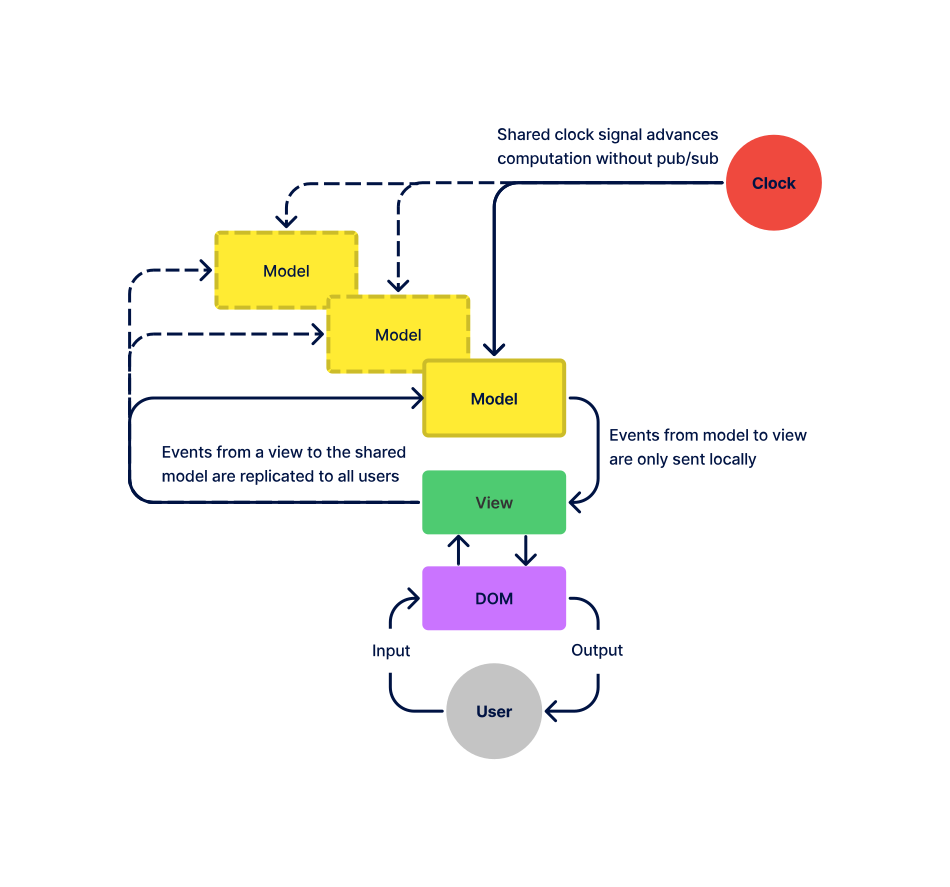

Copyright © 2025 Croquet Labs

Every Multisynq application consists of two parts:

- The **view** handles user input and output by interacting with the DOM.
  It processes all keyboard / mouse / touch events, and determines what is displayed on the screen.

- The **model** handles all calculation and simulation. This is where the actual work of the application takes place.

**The state of the model is guaranteed to always be identical for all users.** However, the state of the view is not. Different users might be running on different hardware platforms, or might display different representations of the simulation.

Internal communications between the model and view are handled through **events**. Whenever an object publishes an event, all objects that have subscribed to that event will execute a handler function.

When a Multisynq application starts up, it becomes part of a **session**. Other users running the same application with the same session ID will also join the same session. The state of the model on every device in the session will be identical.

The routing of events is handled automatically. If an event from a view is handled by a model, the model isn't sent the event directly. Instead Multisynq bounces the event off a synchronizer.

**Synchronizers** are stateless, public, message-passing services located in the cloud. When a synchronizer receives an event from a user, it mirrors it to all the other users in the same session.

**Snapshots** are archived copies of a model's state. Multisynq periodically takes snapshots of the model state and saves it to the cloud. When a new user joins a session, it can synch with the other users by loading one of these snapshots.

- Input/output is routed through the view.
- The view can read from the model, but can't write to it.
- Events from view to model are reflected to all users.
- All other events (model-model, view-view, and especially model-to-view) are only executed locally.
- Model state is automatically saved to (and loaded from) snapshots.
